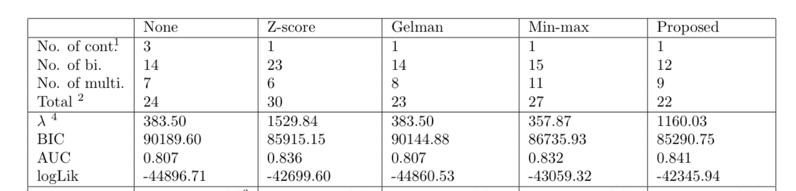

\
\
\
\
\

```{r, message=FALSE, warning=FALSE,echo=FALSE}
knitr::opts_chunk$set(echo = TRUE)
library(knitr)
library(kableExtra)
library(dplyr)
load("simulation2_data/summary_tables.rda")
```


\
\
\

&nbsp;
&nbsp;
&nbsp;

```{r echo=FALSE, message=FALSE, warning=FALSE}
cbind(tb_norm_indep[-c(1,4),c(1:4,6)],
      tb_norm_part[-c(1,4),c(1:4,6)], 
      tb_norm_all[-c(1,4),c(1:4,6)]) %>% 
  as.data.frame() %>% 
  kbl(caption = 'simulations: independent or correlated normal latent variables') %>%
  column_spec(c(6,11), border_right = T) %>%
  add_header_above(c(" "=1, 'S1: latent variables are independent'=5, 'S2: only true latent variables are correlated(0.3)'=5, 'S3: both true and noise latent variables are correlated(0.3)'=5)) %>%
  kable_classic(full_width = F, html_font = "Cambria",lightable_options = c("hover"))%>%
  row_spec(3,background = 'yellow') %>%
  row_spec(4:6, background = 'pink') %>%
  row_spec(7:8, background = 'lightblue') %>%
  pack_rows("\n", 3,8) %>%
  pack_rows("\n", 9,14) %>%
  footnote(general = "Findings from the table",
           number = c("more continuous variables are selected when use None standardization than that of other methods",
            "among all standardizations, the selection rate of binary with percentage of one close to 0.9 is highest in the case of using Z-score",
            "when use Min-max method, the multi-category variables have highest selection rates, compared to other approaches",
            "the Proposed strategy has relative low variable sensitivity but highest variable specificity, and the fact that applying proposed standardization on real data gives highest AUC score and lowest BIC value implies that the proposed method is able to select most of the important features as well as filter out negative effects by ignoring most of the noise variables \n \n",
            "variable sensitivity and specificity decreased for all mehtods in correlated case, but specificity of proposed method does not change much",
            "in independent case, selection rate of multi-category variables tend to be lower than binary(0.5/0.7), in correlated case, selection rate of multi-category tend to be higher than binary(0.5/0.7)"))

```





\
\
\

&nbsp;
&nbsp;
&nbsp;

```{r echo=FALSE, message=FALSE, warning=FALSE}
tb_exp[-c(1,4),c(1:4,6)] %>% 
  as.data.frame() %>% 
  kbl(caption = 'latent exp distribution', bold=T) %>%
  kable_classic(full_width = F, html_font = "Cambria",lightable_options = c("hover"))%>%
  row_spec(3,background = 'yellow') %>%
  row_spec(4:6, background = 'pink') %>%
  row_spec(7:8, background = 'lightblue') %>%
  pack_rows("\n", 3,8) %>%
  pack_rows("\n", 9,14)
```

```{r echo=FALSE, message=FALSE, warning=FALSE}
tb_gamma[-c(1,4),c(1:4,6)] %>% 
  as.data.frame() %>% 
  kbl(caption = 'latent gamma distribution', bold=T) %>%
  kable_classic(full_width = F, html_font = "Cambria",lightable_options = c("hover"))%>%
  row_spec(3,background = 'yellow') %>%
  row_spec(4:6, background = 'pink') %>%
  row_spec(7:8, background = 'lightblue') %>%
  pack_rows("\n", 3,8) %>%
  pack_rows("\n", 9,14)
```
\
\
\

&nbsp;
&nbsp;
&nbsp;